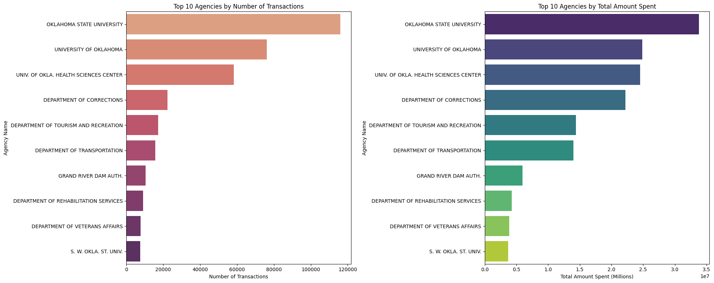
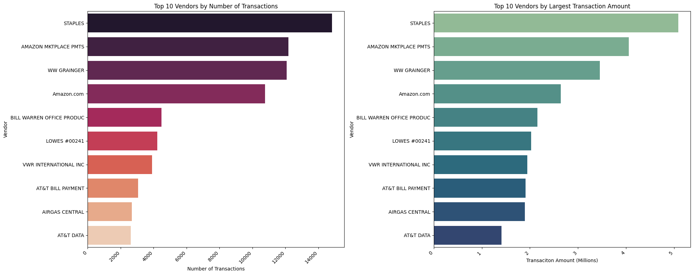
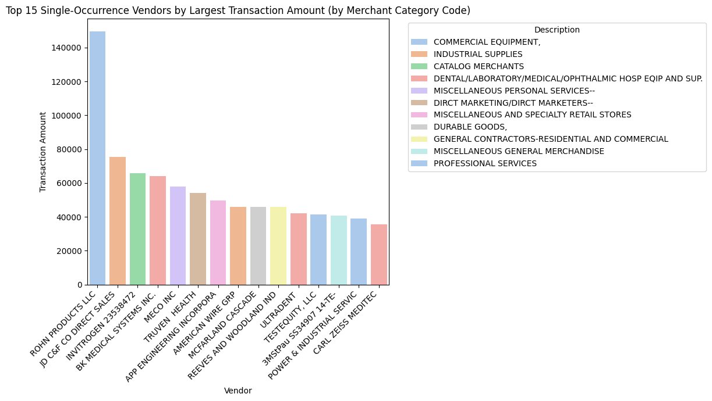
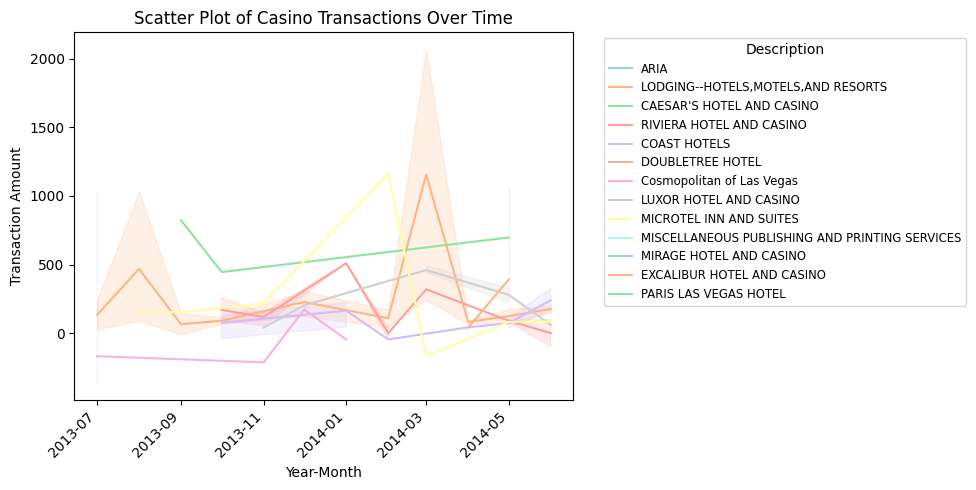

# Creating Software That Can Detect Credit Card Fraud

In this project, I analyzed a large dataset containing information about purchases made by different credit card owners, as well as which agency the card belonged to, which vendor the cardholder purchased from, the cardholder's last names and first initials, the description and merchant category code of the purchase, the amount of money spent, and the month the purchase was made.

## Problem Statement

Credit card fraud is a widespread, ongoing issue, where millions of people's credit cards are being charged for payments they didn't make. I actually had my credit card stolen one time and ended up getting a lot of money charged to my name at a convenience store I've never gone to before. This project is designed to analyze and identify potential cases of fraud by looking at spending outliers, most common vendors and single-occurance/new vendors, merchant category codes (what the money was spent on), and more.

## Data Observations
To analyze this data, I created tables and graphs using Seaborn and MatPlotLib to:
- Organize by agency (to look at most popular agencies)

  
  
- Organize by vendor (more specifically, single-occurrance vendors)

  
  
  
  
- Look at a concentrated study in casinos (since a lot of credit card fraud happens at casinos)

  

## Feature Engineering
I then created several features that could be implemented in order to flag potential cases of fraud. These features are primarily focused on:
- Flagging any unusually high spending
- Visualizing outliers and labeling their merchant category codes and vendor
- Showing the total amount of money each cardholder spends at any vendor and how many transactions occured at each
- Finding the mean, standard deviation, and quartiles for each cardholder's transaction spending to estimate their overall spending habits
- Finding the spending outliers for each cardholder to flag any potential anomalies
- Showing the most frequented vendors of each cardholder and finding any new vendor that they purchase from
- Showing how many times a cardholder spent at a new vendor and how much they spent

## Technologies Used
Python
- Pandas
- Numpy
- MatPlotLib
- Seaborn
